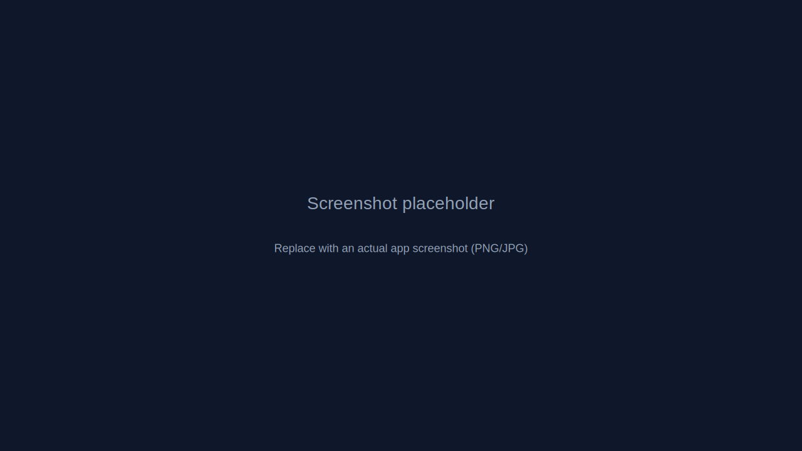

# QuantView — Offline Trading Platform

[](LICENSE)
[](https://www.python.org/)
[](https://nodejs.org/)

A local-first, full-stack offline trading platform with interactive stock charts, technical indicators and financial metrics — designed for research and backtesting.

- Live demo: Develop locally (no cloud required)

## Table of contents

- [Screenshot](#screenshot)
- [Quick start](#quick-start)
- [Architecture](#architecture)
- [Tech stack](#tech-stack)
- [Features](#features)
- [API](#api)
- [Environment variables](#environment-variables)
- [Contributing](#contributing)
- [License](#license)

## Screenshot



## Quick Start

Prerequisites: Python 3.10+, Node.js 18+, npm or pnpm.

Backend (Windows / macOS / Linux):

```powershell
cd backend
python -m venv .venv
# Windows
.venv\Scripts\activate
# macOS / Linux
# source .venv/bin/activate

pip install -r requirements.txt
uvicorn app.main:app --reload --host 127.0.0.1 --port 8000
```

Frontend:

```bash
cd frontend
npm install    # or: pnpm install
npm run dev
```

Open http://localhost:5173 (frontend) and backend API at http://127.0.0.1:8000.

One-line (Windows) deploy helper:

```powershell
.\deploy-local.ps1
```

## Architecture

High-level architecture moved to [ARCHITECTURE.md](./ARCHITECTURE.md) — see that file for the full project tree and component notes.

## Tech stack

### Backend

- FastAPI, Pydantic, yfinance / akshare, backtrader, pandas, numpy

### Frontend

- Vue 3 (Composition API), TypeScript, Vite, ECharts, Element Plus, Pinia, SCSS

## Features

- Stock search (US / HK / CN)
- K-Line / candlestick charts (multiple timeframes)
- Technical indicators (MA, EMA, MACD, RSI, KDJ, BOLL)
- Financial radar (ROE, ROA, margins)
- Watchlist, dark theme, multi-language (zh/en), offline-first

## API

Interactive API docs: http://127.0.0.1:8000/docs

Example curl (search):

```bash
curl "http://127.0.0.1:8000/api/v1/stock/search?keyword=apple"
```

| Method | Path                                                          | Description              |
| ------ | ------------------------------------------------------------- | ------------------------ |
| GET    | `/api/v1/health`                                              | Health check             |
| GET    | `/api/v1/stock/search?keyword={keyword}`                      | Search stock symbols     |
| GET    | `/api/v1/stock/kline?symbol={symbol}&period={period}`         | Get K-line data          |
| GET    | `/api/v1/stock/kline/batch?symbols={s1},{s2}&period={period}` | Batch K-line data        |
| GET    | `/api/v1/stock/finance?symbol={symbol}`                       | Get financial indicators |

## Environment variables

See backend `.env` and frontend `.env.development` for defaults.

### Backend (`backend/.env`)

| Variable               | Default                        | Description                                          |
| ---------------------- | ------------------------------ | ---------------------------------------------------- |
| `APP_NAME`             | `Offline Trading Platform API` | Application name                                     |
| `APP_ENV`              | `development`                  | Environment (`development`, `staging`, `production`) |
| `APP_VERSION`          | `0.1.0`                        | API version                                          |
| `HOST`                 | `127.0.0.1`                    | Server host                                          |
| `PORT`                 | `8000`                         | Server port                                          |
| `DEBUG`                | `true`                         | Debug mode (set `false` in production)               |
| `CORS_ALLOWED_ORIGINS` | `http://localhost:5173`        | Allowed CORS origins                                 |

### Frontend (`frontend/.env.development`)

| Variable            | Default                 | Description          |
| ------------------- | ----------------------- | -------------------- |
| `VITE_API_BASE_URL` | `http://127.0.0.1:8000` | Backend API base URL |

## Contributing

Contributions welcome — fork, create a branch, and open a PR. Add tests for new features and run linters where applicable.

## License

MIT
